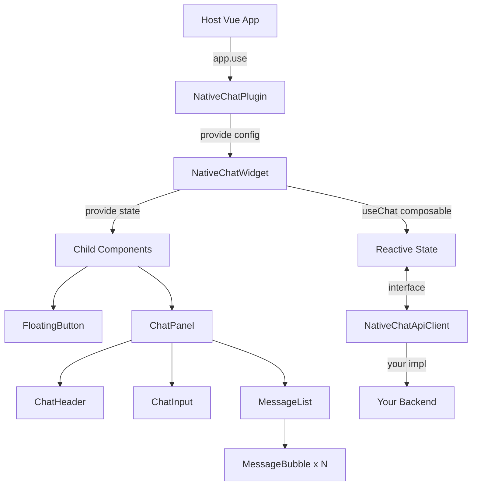

# native-chat-vue

A lightweight, embeddable AI chat widget for Vue 3 + Vuetify 3 applications. Drop in a floating chat panel with markdown rendering, infinite scroll, optimistic UI, and error recovery — backed by any API you choose.

## Table of Contents

- [Features](#features)
- [Quick Start](#quick-start)
- [Installation](#installation)
- [Usage](#usage)
  - [Plugin Registration](#plugin-registration)
  - [Custom API Client](#custom-api-client)
  - [Default Axios Adapter](#default-axios-adapter)
  - [Configuration Options](#configuration-options)
- [API Client Interface](#api-client-interface)
- [Exports](#exports)
- [Architecture](#architecture)
- [Accessibility](#accessibility)
- [Development](#development)
- [Documentation Site](#documentation-site)
- [License](#license)

## Features

- **Floating chat panel** — renders via Teleport, independent of host layout
- **Responsive** — desktop sidebar (420px) and full-screen mobile (<768px)
- **Markdown rendering** — assistant messages rendered with `marked` + `DOMPurify` XSS sanitization
- **Optimistic UI** — user messages appear instantly, with error recovery and retry
- **Infinite scroll** — reverse-chronological pagination with scroll position preservation
- **Backend-agnostic** — provide your own API client or use the included Axios adapter
- **Theming** — custom Vuetify theme that merges non-destructively with your app's theme
- **CSS isolation** — all styles scoped within `@layer native-chat` (no `!important` needed to override)
- **Accessible** — ARIA labels, keyboard navigation, focus management, `prefers-reduced-motion` support
- **Lightweight** — only two runtime dependencies (`marked`, `dompurify`)
- **300+ tests** — unit, integration, and performance benchmarks

## Quick Start

```bash
# Install the package (GitHub Packages registry)
yarn add @turnkeystaffing/get-native-chat-vue
```

```typescript
// main.ts
import { createApp } from 'vue'
import { createVuetify } from 'vuetify'
import NativeChatPlugin from '@turnkeystaffing/get-native-chat-vue'
import '@turnkeystaffing/get-native-chat-vue/style.css'
import { createNativeChatApiClient } from '@turnkeystaffing/get-native-chat-vue'
import axios from 'axios'

const app = createApp(App)
app.use(createVuetify())

const apiClient = createNativeChatApiClient({
  axiosInstance: axios.create({ baseURL: 'https://your-api.example.com' }),
})

app.use(NativeChatPlugin, { apiClient })
app.mount('#app')
```

The plugin registers the chat widget globally. Add it anywhere in your template:

```vue
<template>
  <NativeChatWidget />
</template>
```

## Installation

### Registry Setup

This package uses GitHub Packages as its registry. Configure your `.npmrc` or `.yarnrc.yml` to resolve `@turnkeystaffing` from the GitHub registry:

```ini
# .npmrc
@turnkeystaffing:registry=https://npm.pkg.github.com
//npm.pkg.github.com/:_authToken=${GITHUB_TOKEN}
```

### Install

```bash
yarn add @turnkeystaffing/get-native-chat-vue
```

### Peer Dependencies

| Package | Version | Required |
|---------|---------|----------|
| `vue` | ^3.5.0 | Yes |
| `vuetify` | ^3.11.0 | Yes |
| `axios` | ^1.0.0 | Only if using `createNativeChatApiClient` |

## Usage

### Plugin Registration

Register the plugin with `app.use()` and provide an API client implementation:

```typescript
import NativeChatPlugin from '@turnkeystaffing/get-native-chat-vue'
import '@turnkeystaffing/get-native-chat-vue/style.css'

app.use(NativeChatPlugin, {
  apiClient: yourApiClient,
  position: 'bottom-right',
  welcomeMessage: 'Hello! How can I help you?',
})
```

### Custom API Client

Implement the `NativeChatApiClient` interface to connect to any backend:

```typescript
import type { NativeChatApiClient } from '@turnkeystaffing/get-native-chat-vue'

const myApiClient: NativeChatApiClient = {
  createConversation: () => fetch('/api/conversations', { method: 'POST' }).then((r) => r.json()),
  getConversations: (offset, limit) =>
    fetch(`/api/conversations?offset=${offset}&limit=${limit}`).then((r) => r.json()),
  getMessages: (conversationId, offset, limit) =>
    fetch(
      `/api/conversations/${conversationId}/messages?offset=${offset}&limit=${limit}`,
    ).then((r) => r.json()),
  sendMessage: (conversationId, message) =>
    fetch(`/api/conversations/${conversationId}/messages`, {
      method: 'POST',
      body: JSON.stringify({ message }),
      headers: { 'Content-Type': 'application/json' },
    }).then((r) => r.json()),
}
```

### Default Axios Adapter

Use the built-in helper if your backend follows the expected endpoint conventions:

```typescript
import axios from 'axios'
import { createNativeChatApiClient } from '@turnkeystaffing/get-native-chat-vue'

const apiClient = createNativeChatApiClient({
  axiosInstance: axios.create({
    baseURL: 'https://your-api.example.com',
    headers: { Authorization: `Bearer ${token}` },
  }),
})
```

The adapter maps to these endpoints:

| Method | HTTP | Path |
|--------|------|------|
| `createConversation()` | POST | `/conversations` |
| `getConversations()` | GET | `/conversations?offset=X&limit=Y` |
| `getMessages()` | GET | `/conversations/{id}/messages?offset=X&limit=Y` |
| `sendMessage()` | POST | `/conversations/{id}/messages` |

### Configuration Options

| Option | Type | Default | Description |
|--------|------|---------|-------------|
| `apiClient` | `NativeChatApiClient` | *required* | Backend communication implementation |
| `position` | `'bottom-left'` \| `'bottom-right'` | `'bottom-right'` | Floating button position |
| `welcomeMessage` | `string` | `'Hello! How can I help you?'` | Empty state message |
| `batchSize` | `number` | `20` | Messages loaded per page |
| `conversationId` | `string` | — | Pre-set conversation (skips lookup) |
| `hideToggleWhenOpen` | `boolean` | `false` | Hide the floating button when the panel is open |
| `showBubbleHeaders` | `boolean` | `true` | Show "You" / "AI Assistant" labels on message bubbles |
| `assistantBubbleFullWidth` | `boolean` | `false` | Full-width assistant messages (no bubble chrome) |
| `onError` | `(error: ChatError) => void` | — | Error callback for logging or analytics |

## API Client Interface

```typescript
interface NativeChatApiClient {
  createConversation(): Promise<ConversationResponse>
  getConversations(offset: number, limit: number): Promise<ConversationListResponse>
  getMessages(
    conversationId: string,
    offset: number,
    limit: number,
  ): Promise<MessageHistoryResponse>
  sendMessage(conversationId: string, message: string): Promise<SendMessageResponse>
}
```

See the [full type definitions](src/types/) for response shapes (`ConversationResponse`, `MessageHistoryResponse`, etc.).

## Exports

```typescript
// Plugin (default + named)
import NativeChatPlugin from '@turnkeystaffing/get-native-chat-vue'
import { NativeChatPlugin } from '@turnkeystaffing/get-native-chat-vue'

// Component (for manual registration)
import { NativeChatWidget } from '@turnkeystaffing/get-native-chat-vue'

// Axios adapter helper
import { createNativeChatApiClient } from '@turnkeystaffing/get-native-chat-vue'

// Types
import type {
  NativeChatApiClient,
  NativeChatPluginOptions,
  ChatMessage,
  ChatError,
  MessageStatus,
  ConversationResponse,
} from '@turnkeystaffing/get-native-chat-vue'
```

## Architecture

The host Vue app registers the plugin, which provides configuration down to the widget tree. The `useChat` composable manages all state and delegates to your API client implementation.



**Key patterns:**

- **Plugin + provide/inject** — configuration and state flow down through the component tree
- **Composable state machine** — `useChat()` manages all chat logic (open, send, retry, paginate)
- **Optimistic UI** — messages appear immediately; errors trigger recovery with retry
- **Teleport rendering** — the chat panel renders to `<body>`, independent of host DOM
- **Interface-driven API** — swap backends by providing a different `NativeChatApiClient`

## Accessibility

- ARIA labels on all interactive elements
- `aria-expanded` on the floating button
- `aria-live="polite"` on the message list for screen reader announcements
- Semantic HTML (`<ul>`, `<li>`, `<button>`)
- Keyboard navigation: Escape closes, Enter sends, Shift+Enter for newlines
- Focus management: auto-focus on open, return focus to FAB on close
- All animations respect `prefers-reduced-motion: reduce`

## Development

### Prerequisites

- Node.js 18+ (ES2022 target)
- Corepack enabled (`corepack enable`)

### Setup

```bash
corepack enable
yarn install
```

### Scripts

| Command | Description |
|---------|-------------|
| `yarn build` | Type-check and build the library |
| `yarn test` | Run all 300+ tests |
| `yarn test:watch` | Run tests in watch mode |
| `yarn lint` | Check ESLint + Prettier |
| `yarn lint:fix` | Auto-fix lint and formatting issues |
| `yarn typecheck` | TypeScript type checking only |
| `yarn docs:dev` | Start the VitePress documentation site |
| `yarn perf` | Run Playwright performance benchmarks |

### Tech Stack

| Category | Technology |
|----------|-----------|
| Language | TypeScript 5.9 (strict) |
| Framework | Vue 3.5 + Vuetify 3.11 |
| Build | Vite 7 (library mode, ES module) |
| Testing | Vitest 4 + Playwright |
| Docs | VitePress |
| Package Manager | Yarn 4 (Berry) |

## Documentation Site

The project includes a VitePress documentation site with interactive demos:

```bash
yarn docs:dev
```

## Contributing

This is a proprietary project. See internal team documentation for contribution guidelines.

## License

Proprietary. All rights reserved.
