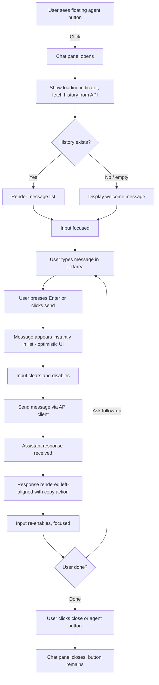
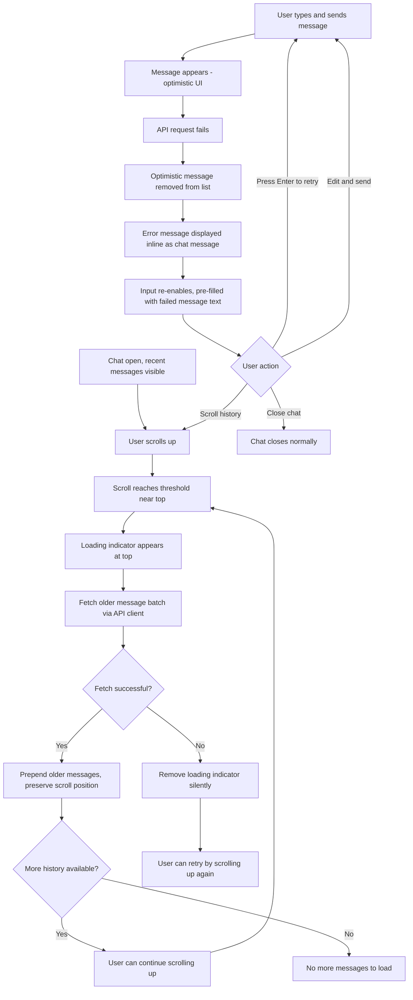
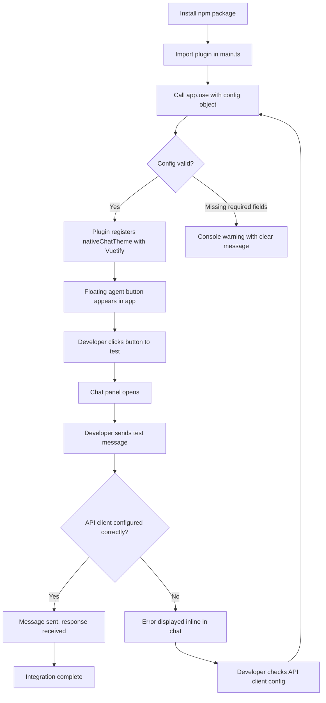

---
stepsCompleted:
  - 1
  - 2
  - 3
  - 4
  - 5
  - 6
  - 7
  - 8
  - 9
  - 10
  - 11
  - 12
  - 13
  - 14
inputDocuments:
  - _bmad-output/planning-artifacts/prd.md
---

# UX Design Specification native-chat-vue

**Author:** Volodymyr
**Date:** 2026-02-19

---

## Executive Summary

### Project Vision

native-chat-vue is a Vue plugin delivering an embeddable conversational interface — a floating chat widget that lives within existing Vue applications. It serves as a unified gateway for affiliates, clients, and contractors to ask questions and retrieve information without leaving the application they already work in. The MVP establishes the core ask-and-answer loop; the architecture is designed to support post-MVP extensibility including custom component rendering, streaming responses, and task automation.

### Target Users

**End Users (Primary):** Internal users — contractors, affiliates, and clients — who are comfortable with chat applications (Telegram-level familiarity). They work primarily on desktop and use the chat for both quick information lookups and longer multi-turn conversations. They are task-focused and value speed and directness over visual richness.

**Developers (Secondary):** Frontend developers integrating the plugin into existing Vue applications. They expect a clean plugin API (`app.use()` with config), zero conflicts with the host app, and minimal integration effort.

### Key Design Challenges

- **Dual conversation modes:** The interface must serve both rapid single-question lookups and extended multi-turn conversations without optimizing for one at the expense of the other.
- **Plugin embeddability:** The chat widget must feel native within any host application while maintaining strict CSS and state isolation — it cannot rely on or conflict with the host app's design system.
- **Infinite scroll orientation:** Loading older messages during history browsing must be seamless — no scroll jumps, no disorientation, and clear visual continuity across batch boundaries.

### Design Opportunities

- **Telegram-familiar interaction patterns:** Leveraging users' existing mental models from Telegram (message bubbles, visual role distinction, Enter-to-send) to minimize learning curve and create instant familiarity.
- **Minimal-friction entry point:** A floating agent button with smooth transitions positions the chat as a lightweight, always-available assistant rather than a separate application.
- **Error as conversation:** Inline error messages within the chat stream keep users in flow and make recovery feel like a natural conversational exchange rather than a system interruption.

## Core User Experience

### Defining Experience

The core experience is a single, uninterrupted loop: **open chat → ask → get answer → continue or close**. Users decide when to engage and for how long — whether that's a 10-second quick lookup or a 20-minute multi-turn session. The chat is always available via the floating button, and the conversation persists between sessions. There is no distinction between "quick" and "deep" modes — the interface serves both naturally through the same interaction pattern.

### Platform Strategy

- **Primary platform:** Desktop web (embedded Vue plugin within host SPA)
- **Input model:** Mouse and keyboard — optimized for keyboard-heavy interaction (Enter-to-send, focus management)
- **Responsive:** Supports viewports from 320px (mobile) to 1920px+ (desktop), but desktop is the primary context
- **No offline requirement:** Chat requires server connectivity; the plugin delegates all API communication to the host app's provided client
- **Floating button positioning:** Configurable by the host application to avoid conflicts with existing UI elements

### Effortless Interactions

- **Opening the chat** — single click, instant panel appearance, recent messages already visible
- **Sending a message** — type and hit Enter; no extra steps, no mode selection, no formatting toolbar
- **Reading a response** — appears inline immediately after the user's message; no navigation, no page change
- **Scrolling history** — seamless infinite scroll loads older messages without interruption, jump, or manual "load more" actions
- **Closing the chat** — single click, conversation preserved for next time
- **Error recovery** — errors appear as chat messages; user simply types again or retries

### Critical Success Moments

1. **First open:** User clicks the button, chat appears with their conversation history intact — immediate signal that this is persistent and reliable.
2. **First answer:** User sends a question and gets a useful response within seconds, right inside the app they're already using — the "this is better than switching to Notion" moment.
3. **Long scroll:** User scrolls deep into history and messages load smoothly with no jank — confidence that nothing is lost.
4. **Error resilience:** Something fails, but the chat stays usable — the user retries without frustration or confusion.

### Experience Principles

1. **Invisible until needed, instant when called** — The chat widget stays out of the way until the user wants it, then responds immediately with zero friction.
2. **Conversation is the interface** — Everything happens in the message stream. Errors, responses, history — all rendered as conversation, not system UI.
3. **Respect the host** — The plugin is a guest in the host application. It isolates its styles, avoids global side effects, and adapts its positioning to the host's needs.
4. **Telegram-native feel** — Leverage familiar chat patterns (bubbles, role distinction, Enter-to-send) so users feel at home from the first interaction.

## Desired Emotional Response

### Primary Emotional Goals

- **Efficiency** — Users feel they got what they needed with minimum effort. No friction, no ceremony. The chat is a tool, not an experience to linger in.
- **Confidence** — Users trust the widget works reliably. History persists, messages send correctly, scrolling is smooth. Nothing feels fragile or uncertain.
- **Calm control** — The user is always in charge. The widget opens when they want, closes when they want, and never interrupts or demands attention.

### Emotional Journey Mapping

| Stage | Desired Feeling |
|---|---|
| **Noticing the button** | Neutral — it's there if I need it, not competing for attention |
| **Opening the chat** | Familiar — feels like opening any chat app I already use |
| **Seeing history** | Reassurance — my past conversations are intact |
| **Typing and sending** | Effortless — zero thought required about how to interact |
| **Receiving a response** | Satisfaction — I got what I needed |
| **Encountering an error** | Calm patience — something went wrong, I'll try again, no big deal |
| **Closing the chat** | Nothing — the widget disappears and I'm back to my work instantly |
| **Returning later** | Continuity — everything is where I left it |

### Micro-Emotions

- **Confidence over confusion** — Every interaction should feel predictable. No ambiguous states, no "did it send?" uncertainty.
- **Calm over anxiety** — Errors and loading states communicate clearly without urgency or alarm. No red banners, no exclamation marks screaming for attention.
- **Accomplishment over frustration** — The user got their answer. That's the whole reward. No gamification, no celebration — just task completion.

### Design Implications

- **Utilitarian aesthetic** — Clean, minimal, no decorative elements. Every pixel serves a function. No confetti, no emoji reactions, no typing animation theatrics.
- **Muted error treatment** — Errors displayed as calm, informational chat messages. Neutral tone, not alarming. Suggest retry without pressure.
- **Instant transitions** — Open/close should feel snappy, not animated for show. If transitions exist, they're fast (<150ms) and functional (orientation aid), not decorative.
- **Silent reliability** — Loading states are subtle (a small spinner or skeleton), not dramatic. The UI communicates "working on it" without demanding the user watch.
- **No empty states that feel broken** — First open with no history should still feel complete and ready, not empty or sad.

### Emotional Design Principles

1. **Tool, not toy** — The widget is a utility. Design for repeated daily use, not first-impression wow factor.
2. **Silence is golden** — The best emotional response is no emotional response. The widget does its job and gets out of the way.
3. **Errors are conversations, not crises** — When things fail, the tone stays calm. The user is never made to feel like something is seriously wrong.
4. **Predictability builds trust** — Same interactions produce same results every time. No surprises, no variable behavior, no "smart" UI that changes on its own.

## UX Pattern Analysis & Inspiration

### Inspiring Products Analysis

**Telegram (Primary Reference)**

Telegram succeeds as a utilitarian chat tool through disciplined simplicity:

- **Instant message delivery feedback** — Messages show sent/delivered/read status without the user needing to think about it. The send action feels immediate and certain.
- **Clean message layout** — User messages right-aligned, incoming messages left-aligned. Role distinction is spatial, not reliant on heavy visual decoration. Minimal chrome around each message.
- **Effortless input** — Single text field, Enter to send, auto-expanding input area. No mode switching, no rich text toolbar cluttering the default view.
- **Smooth scrolling through history** — Long conversation histories scroll without performance degradation. Older messages load seamlessly when scrolling up.
- **Minimal UI surface** — The interface stays out of the way. The conversation content dominates; controls are minimal and predictable.
- **Quiet error handling** — Network issues don't crash the UI. Failed messages show a subtle indicator, and the user can retry without ceremony.

### Transferable UX Patterns

**Message Layout:**
- Left/right alignment for role distinction (assistant left, user right) — immediately familiar to Telegram users
- Compact message bubbles with minimal padding — utilitarian density without feeling cramped
- Timestamps subtle and non-intrusive — available but not demanding attention

**Input Patterns:**
- Single text field at bottom of chat, always visible and ready
- Enter to send, Shift+Enter for newline — matches Telegram's desktop behavior exactly
- Auto-expanding textarea up to a max height, then internal scroll

**Scroll Behavior:**
- New messages auto-scroll to bottom when user is already at the bottom
- If user has scrolled up to read history, do not auto-scroll — respect their position
- Older messages load at the top without disrupting current scroll position

**State Communication:**
- Subtle loading indicator when waiting for assistant response — not a dramatic spinner
- Disabled input during pending response to prevent double-sends
- No read receipts or typing indicators for MVP — keep it simple

### Anti-Patterns to Avoid

- **Intercom-style branding and personality** — "Hey there! How can we help?" opener, agent avatars, company logos in every message. This is a utility, not a customer engagement tool.
- **Floating notification badges** — No unread counts pulsing on the button. The chat is pull-based: user opens it when they want to.
- **Pre-chat forms or surveys** — No "what's your name / email / topic" gates before the user can ask a question. The host app already knows who they are.
- **Animated typing indicators** — The bouncing dots animation is theatrical. A simple "waiting for response" state via disabled input is sufficient.
- **Heavy onboarding flows** — No tutorial overlays, no "here's how chat works" tooltips. Users know how chat works.

### Design Inspiration Strategy

**Adopt directly from Telegram:**
- Left/right message alignment for role distinction
- Enter-to-send, Shift+Enter for newline
- Auto-expanding input with max height cap
- Scroll-position-aware auto-scroll behavior (only auto-scroll when at bottom)

**Adapt for plugin context:**
- Telegram is full-screen; native-chat-vue is a panel/overlay — message density and sizing need to work in a constrained viewport
- Telegram has complex features (stickers, reactions, replies); native-chat-vue strips down to text messages only for MVP — simpler is better here

**Avoid entirely:**
- Personality-driven chat UI (avatars, names, branding per message)
- Notification/badge systems on the floating button
- Pre-chat gates or onboarding flows
- Decorative animations that don't serve a functional purpose

## Design System Foundation

### Design System Choice

**Vuetify 3 as peer dependency with custom theme configuration.**

The plugin consumes the host app's Vuetify installation but applies its own theme to maintain visual consistency and isolation across different host apps. The plugin does not bundle Vuetify — it declares it as a peer dependency alongside Vue 3.

### Rationale for Selection

- **All target host apps already use Vuetify** — zero additional install cost for adopters
- **Built-in accessibility** — Vuetify components ship with ARIA attributes, keyboard navigation, and focus management, supporting WCAG 2.1 Level A compliance out of the box
- **Proven chat-relevant components** — text fields, buttons, cards, lists, scroll containers all available and battle-tested
- **Theming system** — Vuetify's theme API allows the plugin to define its own color palette, typography, and spacing without affecting the host app's theme
- **Bundle size stays minimal** — as a peer dependency, Vuetify adds 0KB to the plugin's production bundle

### Implementation Approach

- Declare `vuetify ^3.x` and `vue ^3.x` as peer dependencies
- Plugin registers its own Vuetify theme (e.g., `nativeChatTheme`) during `app.use()` initialization
- All plugin components render within a scoped theme provider to prevent style leakage in both directions
- Use only the Vuetify components needed for MVP: `v-btn`, `v-navigation-drawer`, `v-textarea`, `v-infinite-scroll`, `v-icon`, `v-theme-provider`, `v-progress-circular`
- Wrap all plugin styles in CSS `@layer native-chat` for specificity control against host app global styles
- No global Vuetify configuration modifications — the plugin is a theme consumer, not a theme modifier

### Customization Strategy

- **Plugin-level theme:** Define a self-contained Vuetify theme with colors, typography, and component defaults tailored to the utilitarian, Telegram-inspired aesthetic
- **Host-configurable overrides:** Allow the host app to pass theme overrides through plugin config if they want the chat to match their branding (post-MVP consideration)
- **CSS scoping:** Plugin components use a combination of CSS `@layer native-chat` for specificity control and Vuetify's `v-theme-provider` for theme isolation. This prevents host app global selectors from overriding plugin styles without `!important` hacks or global class collisions. Note: host apps with aggressive global selectors (`* {}` resets, bare tag-level styles) may need minor adjustments — this is documented in integration notes

### PRD Update Note

The non-functional requirement "No runtime dependencies beyond Vue 3.x as a peer dependency" should be updated to include Vuetify 3.x as an accepted peer dependency.

## Defining Experience

### Core Interaction

**"Ask a question inside your app, get an answer without leaving."**

The defining experience is the complete ask-and-answer loop: user clicks the floating button, types a question, gets a useful response — all without navigating away from what they were doing. If this loop feels instant and effortless, the product succeeds. Everything else (history, scrolling, error handling) exists to support this single interaction.

### User Mental Model

Users bring the **Telegram chat mental model**: a text field at the bottom, messages stacking upward, my messages on the right, the other party's on the left. They expect Enter to send, they expect to scroll up for history, and they expect the conversation to be there next time they open it.

What's different from Telegram: the "other party" is an assistant, not a person. Users don't expect typing indicators or online/offline status. They expect a response — possibly with a brief wait — and they expect it to be useful.

**Current workaround being replaced:** Users currently leave the app to search Notion, Google Docs, or PDFs for information. The mental model shift is from "navigate to find information" to "ask and receive information."

### Success Criteria

- **User sends a message and sees it appear instantly** — optimistic UI, no waiting for server confirmation
- **Assistant response arrives and renders within seconds** — the gap between question and answer feels short
- **Conversation history is intact on re-open** — users trust that nothing is lost
- **The first-time experience works immediately** — a welcome message signals readiness, user types and gets a response with zero setup
- **The chat never breaks the host app** — no visual glitches, no performance hits, no console errors

### Pattern Analysis

**Fully established patterns.** Chat interfaces are among the most universally understood interaction models. No user education is needed. The innovation is contextual (bringing chat into the host app as a plugin), not interactional.

Patterns adopted directly:
- Message bubbles with left/right role alignment (Telegram)
- Enter-to-send, Shift+Enter for newline (Telegram desktop)
- Auto-expanding input (Telegram)
- Scroll-up for history with seamless loading (Telegram)
- Floating action button as entry point (Material Design FAB pattern, familiar in Vuetify apps)

### Experience Mechanics

**1. Initiation:**
- User clicks the floating agent button (always visible in a configurable position)
- Chat panel opens — if returning user, recent message history is loaded; if first-time user, a single welcome message is displayed
- Input field receives focus automatically

**2. Interaction:**
- User types in the auto-expanding textarea
- Presses Enter to send (Shift+Enter for newline)
- Message appears immediately in the list (optimistic UI, right-aligned)
- Input clears and disables while awaiting response
- Send button also available for mouse/touch users

**3. Feedback:**
- User's message visible instantly — confirms "it sent"
- Subtle loading state while waiting for assistant response (disabled input signals "processing")
- Assistant response appears left-aligned when received
- Input re-enables — ready for the next question

**4. Completion:**
- User got their answer — they either ask a follow-up or close the chat
- Closing is a single click (button or close control)
- Chat panel disappears, floating button remains
- Conversation persists for next session

## Visual Design Foundation

### Color System

The plugin uses the host application's existing color palette to feel native:

**Primary Colors:**
- Primary / Text: `#002B38` (dark teal) — headings, body text, user message bubbles
- Secondary / Accent: `#C4105B` (magenta) — floating button, send button, active indicators, assistant icon accent

**Background & Surface:**
- Page Background: `#F8F8F8` — host app background
- Chat Panel: `#FFFFFF` — chat panel background
- User Bubble: `#002B38` — dark teal (primary)
- Assistant Bubble: `#FFFFFF` with `#EBEBED` border — white with subtle border
- Input Field: `#FFFFFF` with `#CCCCD1` border

**Text Colors:**
- Primary Text: `#002B38` — assistant messages, headings, labels
- User Bubble Text: `#FDFDFD` — white text on dark teal bubbles
- Hint/Placeholder: `#727272` — input placeholder, secondary info
- Welcome Text: light gray (`#B0BCC0` or similar) — large greeting message

**Semantic Colors:**
- Success: `#41A58D` (green)
- Error: `#DE3232` (red)
- Disabled: `#B0BCC0` (gray)
- Dividers: `#EBEBED`
- Borders: `#CCCCD1`

### Typography System

**Font Family:** Open Sans (all weights) — matches host application

**Type Scale:**

| Role | Size | Weight | Line Height | Usage |
|---|---|---|---|---|
| Welcome greeting | ~24px | Regular | 1.4 | "Hello! How can I help you?" placeholder |
| Assistant heading | 14px | Bold (700) | 1.4 | Bold headings within assistant responses (e.g., "Report assistant") |
| Body text | 14px | Regular (400) | 1.4 | Message content, assistant responses |
| Body semibold | 14px | SemiBold (600) | 1.4 | Labels like "AI Assistant", user name |
| Small text | 12px | Regular (400) | 1.6 | Timestamps, secondary info |
| Input text | 14px | Regular (400) | 1.25 | Textarea input |

### Spacing & Layout Foundation

**Chat Panel Dimensions:**
- Panel width: ~400px (right-aligned overlay)
- Panel height: full viewport height or near-full
- Border radius: 20px (top corners of panel)
- Internal padding: 16-24px horizontal

**Message Layout:**
- User messages: right-aligned, dark teal bubble, rounded corners (~12-16px)
- Assistant messages: left-aligned, white bubble with border, rounded corners (~12-16px)
- Message spacing: ~16px vertical gap between message groups
- Sender label + avatar displayed above each message group

**Input Area:**
- Bottom-pinned, full width of chat panel
- Rounded input field (~50px border-radius pill shape)
- Send button icon (right, magenta)
- Padding: 16px from panel edges

**Floating Agent Button:**
- Circular, magenta (`#C4105B`) background
- Star icon in white
- Size: ~56px diameter
- Position: configurable (shown bottom-left in design)
- Elevated with shadow

**Component Border Radius:**
- Chat panel: 20px
- Message bubbles: 12-16px
- Input field: pill (large radius)
- Floating button: 50% (circle)

### Chat-Specific UI Elements (from Figma)

**Header Bar:**
- Star icon (magenta) + "AI Assistant" title (semibold)
- Close button (X icon, right)

**Welcome State:**
- Large, light-colored greeting text centered in the panel
- Shown on first open or empty conversation

**Assistant Message Features:**
- Supports rich text: bold headings, paragraphs, bullet lists
- Copy action below each assistant message: small, subtle gray copy icon — utilitarian, not prominent

**User Message Features:**
- Dark teal bubble with white text
- User name + avatar displayed above the bubble (right-aligned)

### Accessibility Considerations

- **Contrast ratios:** White text (`#FDFDFD`) on dark teal (`#002B38`) exceeds 4.5:1. Dark text (`#002B38`) on white exceeds 4.5:1. Both meet WCAG 2.1 Level A.
- **Hint text:** `#727272` on white background — verify 4.5:1 ratio (may need adjustment for small text)
- **Interactive elements:** All buttons and icons maintain ≥44px tap target (floating button 56px, send button adequately sized)
- **Focus indicators:** Vuetify provides default focus rings; ensure visible on all interactive elements within the chat panel
- **ARIA:** Chat panel as `role="complementary"`, message list as live region for screen reader announcements

## Design Direction Decision

### Design Directions Explored

The design direction was established through direct Figma design work rather than exploratory mockups. The chat widget design was created in the Native application's existing Figma file (AIngel), ensuring visual consistency with the host application from the start.

### Chosen Direction

**Native-integrated chat panel** — a right-side overlay panel that uses the host application's exact design language:

- **Panel:** White background, 20px rounded corners, right-aligned overlay
- **Header:** Magenta star icon + "AI Assistant" title + close control
- **User messages:** Dark teal (`#002B38`) bubbles, right-aligned, white text, user name + avatar above
- **Assistant messages:** White bubbles with `#EBEBED` border, left-aligned, dark text, "AI Assistant" label + icon above
- **Rich content:** Assistant messages support bold headings, body paragraphs, and bullet lists
- **Copy action:** Copy icon below assistant messages (subtle gray)
- **Input:** Bottom-pinned pill-shaped input field, magenta send arrow (right)
- **Welcome state:** Large light-gray greeting text ("Hello! How can I help you?")
- **Floating button:** Magenta circle with star icon, configurable position

### Design Rationale

- **Same palette as host app** — dark teal primary, magenta accent — makes the chat feel like a built-in feature, not a third-party widget
- **Open Sans typography** — matches host app exactly, zero visual friction
- **Telegram-familiar layout** — left/right message alignment, input at bottom, scroll for history
- **Copy action** — copy icon below assistant messages is a functional tool, not a decorative element — aligns with the "tool, not toy" principle
- **Rich content support** — assistant responses can include structured text (headings, lists) for detailed answers, not just plain text

### Implementation Approach

- Implement the Figma design as-is using Vuetify 3 components within a scoped theme provider
- Use `v-navigation-drawer` for the chat panel, `v-btn` for floating button and actions, `v-textarea` for input
- Map Figma color tokens directly to Vuetify theme variables (`nativeChatTheme`)
- Message bubbles as custom styled components (no direct Vuetify equivalent for chat bubbles)
- Rich text rendering for assistant messages (markdown or structured HTML)

## User Journey Flows

### Journey 1: End User — Ask and Get Answer (Happy Path)

**Actor:** Dmitry (contractor)
**Goal:** Get an answer without leaving the app



**Key UX Details:**
- Message appears in list within one frame (16ms) of send — optimistic UI
- Input disables during pending response — prevents double-send
- Auto-scroll to bottom when new message arrives (if user is at bottom)
- Copy icon below assistant message — single click copies response text to clipboard
- Chat panel closes instantly, conversation persists for next open

### Journey 2: End User — Error Recovery & History Browsing

**Actor:** Dmitry (contractor)
**Goal:** Browse history, recover from errors gracefully



**Key UX Details:**
- Scroll position preserved when older messages prepend — no jump
- Failed history fetch is silent — no error banner, loading indicator just disappears, user can retry by scrolling up again
- Failed message send: optimistic message is removed from the list, inline error message appears in calm neutral tone, and the input is re-populated with the failed message text
- Input re-enables immediately after error with failed text pre-filled — user can press Enter to retry or edit before resending
- Chat remains fully functional during error state — scrolling, closing all work

### Journey 3: Developer — Plugin Integration

**Actor:** Olena (frontend developer)
**Goal:** Integrate native-chat-vue into existing Vue + Vuetify app



**Config object shape:**
```typescript
app.use(NativeChatPlugin, {
  apiClient: ApiClientInterface, // see Technical Specification for interface definition
  // optional
  position?: 'bottom-left' | 'bottom-right',
  welcomeMessage?: string,
  batchSize?: number // default 20
})
```

**Key UX Details:**
- Plugin registration is a single `app.use()` call — no additional setup
- Missing config fields produce clear console warnings, not silent failures
- Plugin registers its own Vuetify theme without modifying host theme
- Floating button appears automatically after successful registration
- Zero console errors, no CSS bleed, no host app side effects

### Journey Patterns

**Entry Pattern:**
- All end-user journeys start with a single click on the floating button
- Chat opens with context (history or welcome message) — never a blank/broken state

**Send-Respond Pattern:**
- Optimistic UI → disable input → wait → render response → re-enable input
- This pattern is identical for happy path and error cases, only the response content differs

**Error Recovery Pattern:**
- On send failure: optimistic message is removed from list, error appears as inline chat message, input is re-populated with the failed text
- Errors are displayed as chat messages, not system UI (toasts, modals, banners)
- Input always re-enables after error with failed text pre-filled — user presses Enter to retry or edits before resending
- Failed messages are ephemeral local state — never persisted server-side

**History Loading Pattern:**
- Triggered by scroll position, not by a button
- Preserves scroll position on prepend
- Silent failure — no error shown for failed history fetch, user retries naturally by scrolling

### Flow Optimization Principles

1. **Minimum steps to value:** Click button → type → Enter → answer. Four actions from intent to result.
2. **No dead ends:** Every error state has a natural exit — retype, scroll, or close. No state requires a page reload.
3. **Progressive loading:** History loads on demand, not all at once. Recent messages load on open, older messages load on scroll.
4. **Silent resilience:** Network hiccups during history loading are absorbed quietly. Only message send failures are surfaced — and even those are calm inline messages.

## Component Strategy

### Design System Components (Vuetify 3)

| Vuetify Component | Usage in Chat Plugin | Customization |
|---|---|---|
| `v-btn` | Floating agent button, send button, copy action, close button | Themed via `nativeChatTheme`; FAB variant for floating button |
| `v-navigation-drawer` | Chat panel container | `location="right"`, `temporary`, custom width (~400px), border-radius (20px) |
| `v-textarea` | Auto-expanding message input | Max 6 rows, pill border-radius, custom placeholder |
| `v-icon` | Close (X), send arrow, copy, star icon | Magenta for send/star, gray for actions |
| `v-theme-provider` | Scoped theme wrapper for all plugin components | Wraps entire plugin tree in `nativeChatTheme` |
| `v-infinite-scroll` | Message list container with history loading | `side="start"`, custom scroll behavior, handles debounce and loading state |
| `v-progress-circular` | Loading indicator for history fetch | Small, subtle, placed at top of message list |

### Custom Components

#### ChatPanel

**Purpose:** Root container — the overlay panel that holds header, message list, and input area.
**States:** Open, closed (controlled by floating button toggle)
**Anatomy:** Header bar (top) → message list (scrollable middle) → input area (bottom-pinned)
**Vuetify component:** `v-navigation-drawer` with `location="right"` and `temporary` prop
**Accessibility:** `role="complementary"`, `aria-label="Chat with AI Assistant"`

#### MessageBubble

**Purpose:** Renders a single message — user or assistant variant.
**Variants:**
- **User:** Right-aligned, dark teal (`#002B38`) background, white text, user name + avatar above
- **Assistant:** Left-aligned, white background with `#EBEBED` border, dark text, "AI Assistant" label + star icon above
- **Error:** Left-aligned, same as assistant style but with error-toned content text

**Content:**
- User: plain text only (MVP)
- Assistant: rich text — bold headings, paragraphs, bullet lists

**Actions:** Copy icon below assistant messages only (MVP)
**Accessibility:** `role="listitem"`, `aria-label` indicating sender role

#### MessageList

**Purpose:** Scrollable container for all messages with infinite scroll.
**Vuetify component:** Uses `v-infinite-scroll` with `side="start"` for upward history loading — handles scroll threshold detection, debounce, and duplicate request prevention.
**Behavior:**
- Auto-scrolls to bottom on new message (if user is at bottom)
- Preserves scroll position when older messages prepend (custom `scrollTop` adjustment after prepend)
- History fetch triggered automatically by `v-infinite-scroll` when scrolling near the top
- Shows subtle loading indicator at top during fetch

**States:** Loading (fetching history), loaded, empty (welcome state), error
**Accessibility:** `role="list"`, `aria-live="polite"` for new message announcements

#### ChatHeader

**Purpose:** Top bar with title and close control.
**Anatomy:** Star icon (magenta) + "AI Assistant" title (left) | close X (right)
**Actions:** Close button closes the panel
**Accessibility:** Close button has `aria-label="Close chat"`, keyboard accessible

#### ChatInput

**Purpose:** Wraps the auto-expanding textarea and send button.
**Anatomy:** Textarea (auto-expanding, max 6 rows) + send button (magenta arrow, right-aligned)
**States:** Default (ready), disabled (awaiting response), focused
**Behavior:** Enter sends, Shift+Enter adds newline, input clears on send, disables during pending response
**Accessibility:** `aria-label="Type a message"`, send button has `aria-label="Send message"`

#### WelcomeState

**Purpose:** Displayed when chat has no conversation history (after initial load completes with empty result).
**Content:** Large, light-gray text: "Hello! How can I help you?" (configurable via plugin options)
**Behavior:** Only shown after the initial history fetch completes with zero messages. Never shown during loading — a loading indicator is displayed while history is being fetched. Disappears once the first message is sent.

#### FloatingButton

**Purpose:** Entry point — always-visible button that toggles the chat panel.
**Anatomy:** Circular magenta (`#C4105B`) button with white star icon
**Size:** ~56px diameter
**Position:** Configurable (`bottom-left` or `bottom-right`, default `bottom-right`)
**States:** Default, hover (slight elevation change), chat-open (panel visible)
**Accessibility:** `aria-label="Open chat"` / `aria-label="Close chat"` (toggles), `aria-expanded` attribute

### Component Implementation Strategy

- All custom components are built as Vue 3 SFC (Single File Components) using `<script setup lang="ts">`
- Styles use Vuetify theme tokens via the scoped `nativeChatTheme` — no hardcoded hex values in component CSS
- Components consume Vuetify primitives internally (`v-btn`, `v-icon`, `v-textarea`) for accessibility and consistency
- All components are internal to the plugin — not exported for host app use (MVP)
- Plugin exports only: the install function and TypeScript interfaces for config

### Implementation Roadmap

**MVP — All components:**

The component surface is small enough to build in a single phase:

1. `FloatingButton` — entry point, needed first to test anything
2. `ChatPanel` + `ChatHeader` — container and controls
3. `MessageList` + `MessageBubble` — core display
4. `ChatInput` — user interaction
5. `WelcomeState` — first-open experience

All six custom components plus Vuetify integration constitute the MVP. No phasing needed — the chat doesn't function without any of them.

## UX Consistency Patterns

### Feedback Patterns

**Success Feedback:**
- No explicit success indicators for message send — the message appearing in the list *is* the success feedback (optimistic UI)
- Copy action: icon changes to a checkmark for ~1.5 seconds then reverts to the copy icon. If the clipboard write fails (browser permission denied), the failure is silent — no error shown

**Error Feedback:**
- All errors render as inline chat messages, left-aligned, assistant style
- Error message text is calm and informational: "Something went wrong. You can try sending your message again."
- No red backgrounds, no alert icons, no exclamation marks — error messages use the same visual container as assistant messages with neutral text
- On message send failure: the optimistic user message is removed from the list, the error message appears inline, and the input is re-populated with the failed message text
- Failed messages are ephemeral local state — they are never persisted to the server and naturally disappear on next session
- Input re-enables immediately after error display, pre-filled with the failed text for easy retry

**Loading Feedback:**
- History fetch: small `v-progress-circular` at the top of the message list, disappears when batch loads or fails
- Response pending: input field and send button disable — the disabled state *is* the loading indicator, no separate spinner in the message area
- Chat open (initial load): message list shows loading indicator until first batch of history arrives

### Loading & Empty States

**Chat Open (All Cases):**
- Chat always opens with a loading indicator first while history is fetched from the API
- After fetch completes: if messages exist, render them; if empty, show welcome message
- Input field ready and focused once loading completes — user can type immediately

**Welcome State (Empty History Only):**
- Welcome message displayed only after history fetch completes with zero messages: large, light-gray text ("Hello! How can I help you?")
- Never shown during loading — prevents flash of welcome followed by history appearing

**Returning Open (With History):**
- Most recent messages load first (latest batch)
- Loading indicator shown briefly while fetching
- Messages render, input focuses — ready for interaction

**Empty After Error:**
- If initial history fetch fails, show welcome message as fallback — the chat is still usable for new messages even without history
- No "retry loading" button — user can scroll up to trigger another fetch attempt

### Interaction Patterns

**Button Hierarchy:**

| Priority | Style | Usage |
|---|---|---|
| Primary action | Magenta (`#C4105B`) filled | Send button, floating agent button |
| Secondary action | Icon-only, gray | Copy, close (X) |
| Disabled | Muted/grayed out | Send button and input during pending response |

**Input Behavior:**
- Enter → send message (consistent, never changes)
- Shift+Enter → newline (consistent, never changes)
- Empty input + Enter → no action (send button also disabled when input is empty)
- Input auto-expands from 1 row to max 6 rows, then scrolls internally
- Input always clears after successful send
- On send failure: input re-enables and is pre-filled with the failed message text for easy retry
- Input re-enables after response received or error displayed

**Panel Toggle:**
- Floating button click → panel opens (if closed) or closes (if open)
- Close (X) in header → panel closes
- No click-outside-to-close — the chat is a persistent side panel; users interact with host app and chat simultaneously
- Panel state (open/closed) is not persisted across page reloads

### Scroll Behavior Patterns

**Auto-Scroll Rules:**
- If user is at or near the bottom of the message list → auto-scroll to bottom when new message appears (both user's own message and assistant response)
- If user has scrolled up (reading history) → do NOT auto-scroll — respect their position
- "Near bottom" threshold: within ~50px of the bottom edge

**Infinite Scroll Rules:**
- Implemented via Vuetify's `v-infinite-scroll` with `side="start"` — handles scroll threshold detection, debounce, and duplicate request prevention automatically
- Fetch: request next batch (configurable size, default 20) via API client
- On success: prepend messages at top, adjust scroll position to maintain current view (custom `scrollTop` adjustment)
- On failure: silently remove loading indicator, no error shown — user can retry by scrolling up again
- End of history: no more fetches triggered, no "you've reached the beginning" indicator needed

**Scroll Position Preservation:**
- When older messages prepend, calculate height difference and adjust `scrollTop` so the user's current view doesn't shift
- This is the single most critical scroll behavior to get right — any jump breaks user trust

## Responsive Design & Accessibility

### Responsive Strategy

**Desktop (1024px+) — Primary context:**
- Chat panel: fixed-width (~400px) overlay, right-aligned
- Floating button: configurable position, 56px diameter
- Full chat experience as designed in Figma

**Tablet (768px - 1023px):**
- Chat panel: same overlay behavior as desktop, width may flex slightly (~360-400px)
- All touch targets already meet 44px minimum (Vuetify defaults)
- No layout changes needed — the panel overlay model works at this size

**Mobile (320px - 767px):**
- Chat panel: **full-screen takeover** — panel expands to fill the entire viewport
- Floating button: same size (56px), positioned at bottom-right
- When chat opens, it replaces the entire view — no partial overlay
- Close button (X) returns to the host app
- Input area pinned to bottom, respects virtual keyboard (viewport resize)
- **Post-MVP:** Add `history.pushState` integration so browser back button and swipe gestures close the chat naturally on mobile

### Breakpoint Strategy

| Breakpoint | Width | Chat Panel Behavior |
|---|---|---|
| Mobile | 320px - 767px | Full-screen takeover |
| Tablet | 768px - 1023px | Right-side overlay (~360-400px) |
| Desktop | 1024px+ | Right-side overlay (~400px) |

- Use Vuetify's built-in breakpoint system (`$vuetify.display`) for consistency with host app
- Mobile-first CSS: full-screen is the base, overlay is the enhancement
- Single breakpoint transition at 768px — below is full-screen, above is overlay

### Accessibility Strategy

**WCAG 2.1 Level A compliance** (as specified in PRD).

**Keyboard Navigation:**
- Tab: moves between floating button → chat header controls → message list → input → send button
- Enter: sends message (when input focused), activates buttons
- Shift+Enter: newline in input
- Escape: closes chat panel (returns focus to floating button)
- Arrow keys: scroll through message list when focused

**Screen Reader Support:**
- Chat panel: `role="complementary"`, `aria-label="Chat with AI Assistant"`
- Message list: `role="list"`, `aria-live="polite"` announces new messages
- Each message: `role="listitem"`, `aria-label` with sender and content summary
- Floating button: `aria-label="Open chat"` / `"Close chat"`, `aria-expanded="true/false"`
- Input: `aria-label="Type a message"`
- Send button: `aria-label="Send message"`, `aria-disabled` when pending

**Focus Management:**
- Opening chat: focus moves to input field
- Closing chat: focus returns to floating button
- After sending message: focus stays on input field
- After error: focus stays on input field
- No focus trap — the chat is a persistent side panel (`role="complementary"`), not a modal dialog. Users can interact with both the host app and the chat simultaneously

**Color & Contrast:**
- `#FDFDFD` on `#002B38` (user bubbles): contrast ratio ~15.5:1 — passes AAA
- `#002B38` on `#FFFFFF` (assistant bubbles): contrast ratio ~16.1:1 — passes AAA
- `#727272` on `#FFFFFF` (hint text): contrast ratio ~4.6:1 — passes AA for normal text
- All interactive elements have visible focus indicators (Vuetify default focus rings)

### Testing Strategy

**Responsive Testing:**
- Test chat panel on: 320px, 375px, 414px (mobile), 768px, 1024px (tablet), 1280px, 1920px (desktop)
- Verify full-screen takeover on mobile breakpoint
- Verify overlay behavior on tablet/desktop
- Test with virtual keyboard open on mobile (input area stays visible)

**Accessibility Testing:**
- Keyboard-only navigation: complete a full conversation without mouse
- Screen reader: test with NVDA (Windows) and VoiceOver (macOS)
- Verify `aria-live` announces new messages correctly
- Verify no focus trap — Tab should move between chat panel elements and host app naturally
- Run axe-core or Lighthouse accessibility audit — zero critical violations

**Browser Testing:**
- Chrome, Firefox, Safari, Edge (latest 2 versions each, per PRD)
- Verify CSS isolation: no style leakage in any browser

### Implementation Guidelines

**Responsive:**
- Use Vuetify's `useDisplay()` composable to detect breakpoint
- Chat panel component conditionally applies full-screen class below 768px
- Use `dvh` (dynamic viewport height) on mobile to handle virtual keyboard correctly
- No horizontal scroll at any viewport width

**Accessibility:**
- Use semantic HTML: `<aside>` or `<section>`, `<ul>/<li>` for messages, `<textarea>` for input
- Vuetify components provide base ARIA attributes — supplement with custom `aria-label` and `aria-live`
- No focus trap — the panel uses `role="complementary"`, allowing natural Tab navigation between chat and host app
- Test that `aria-live="polite"` doesn't announce history loads (only new messages)
